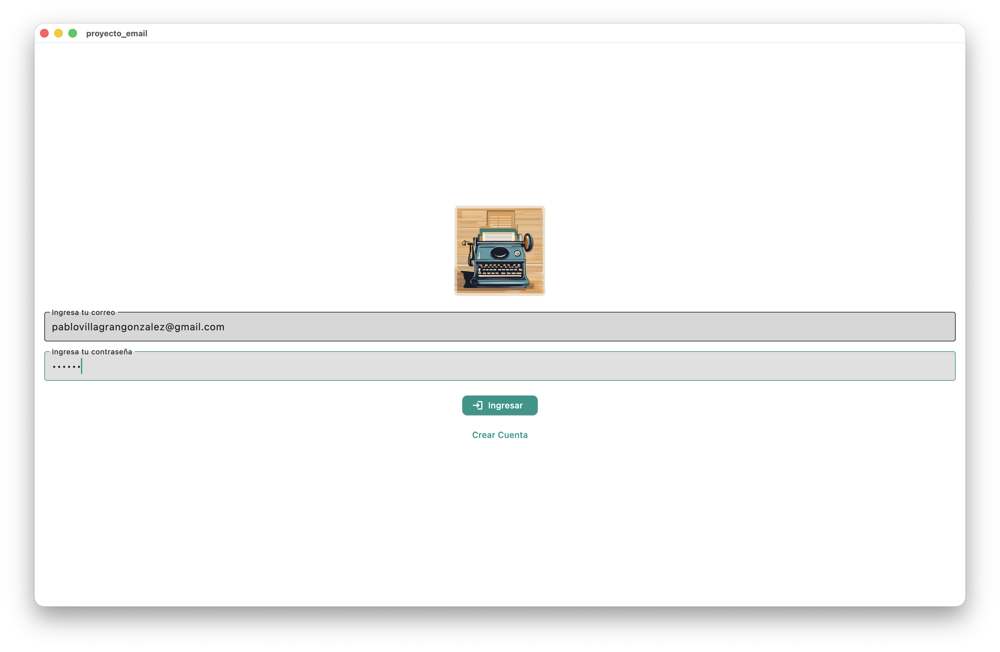
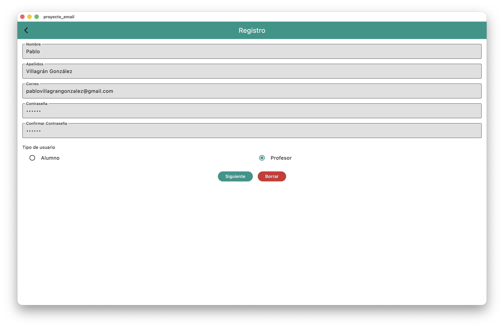
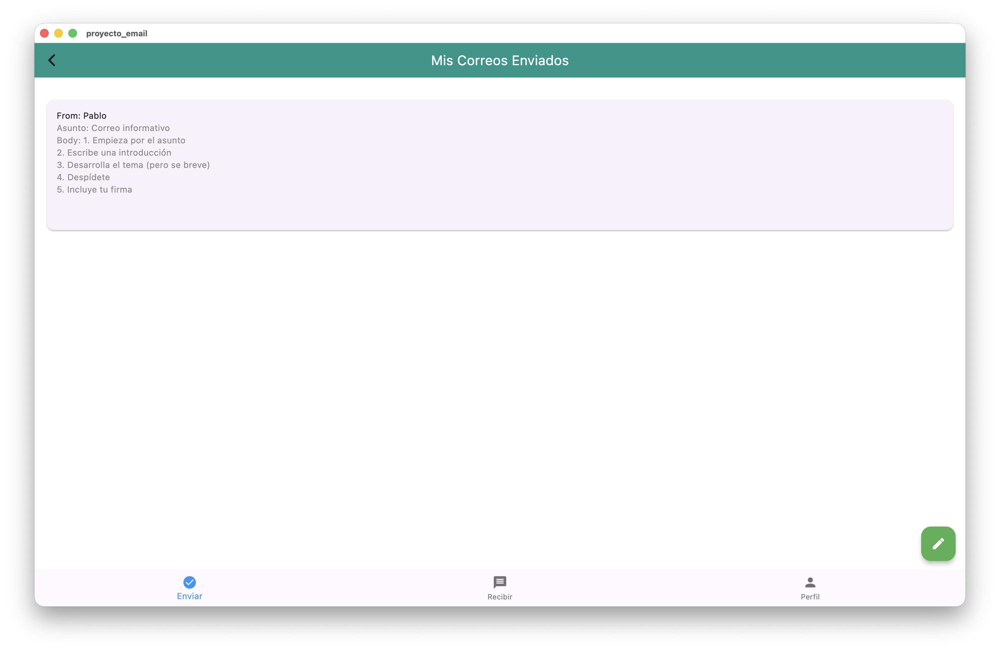
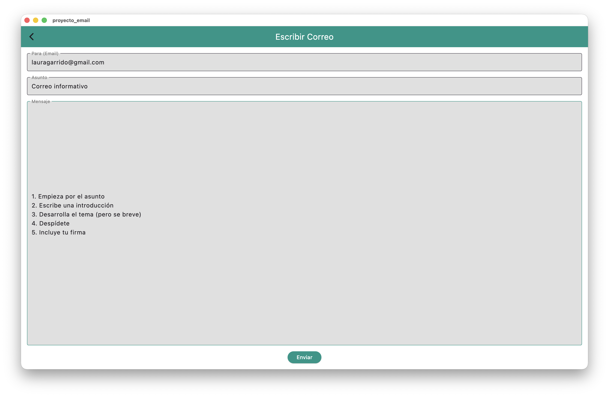
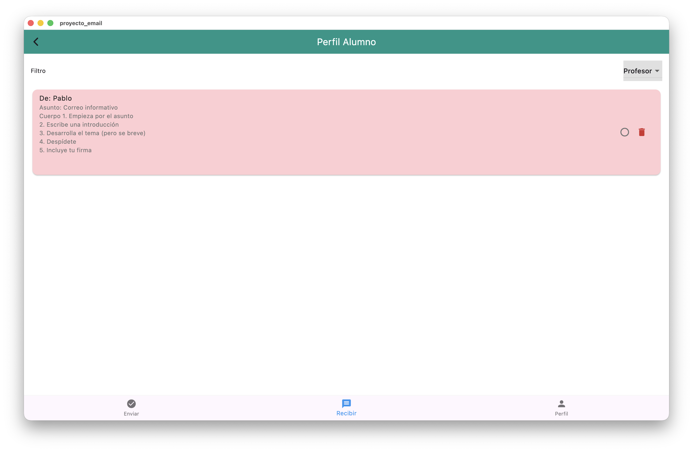
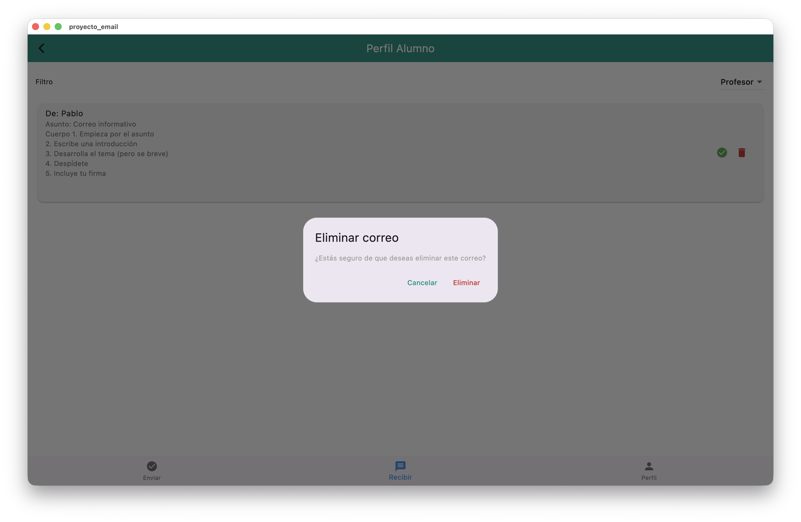
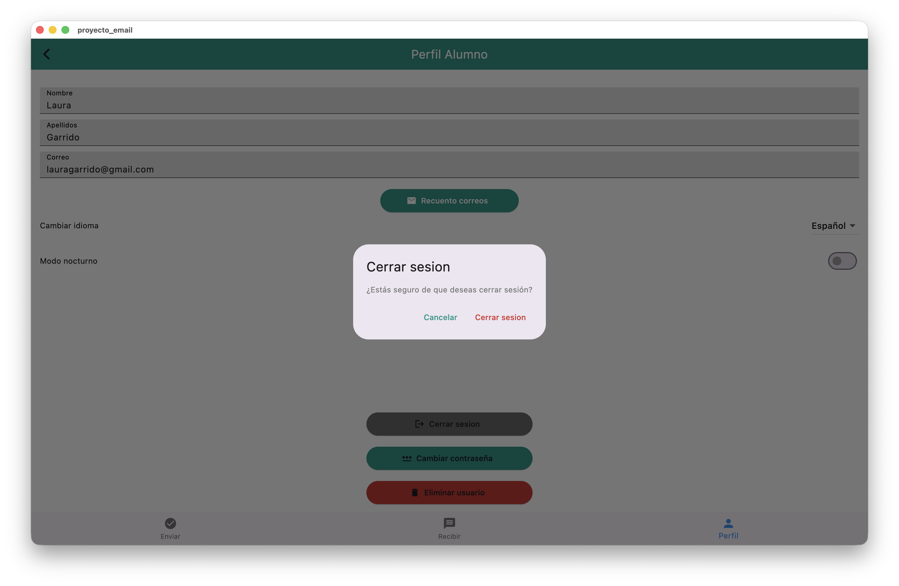
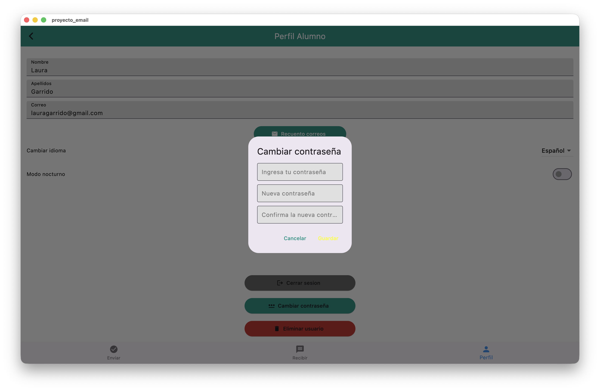
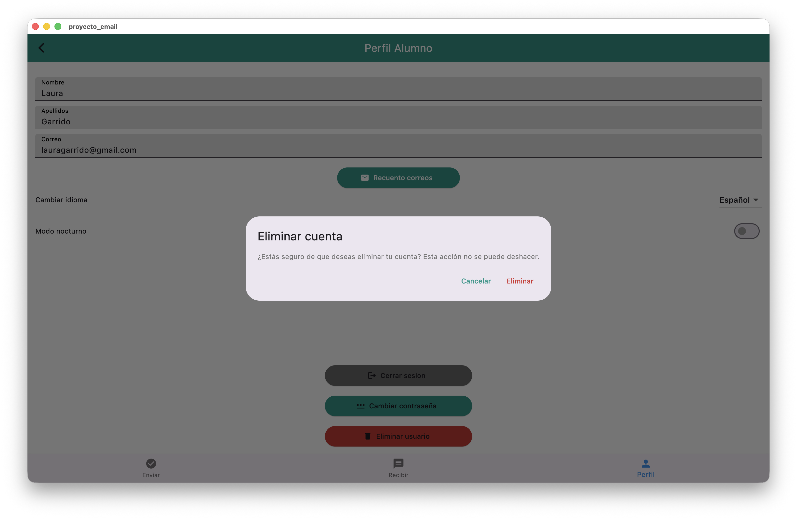
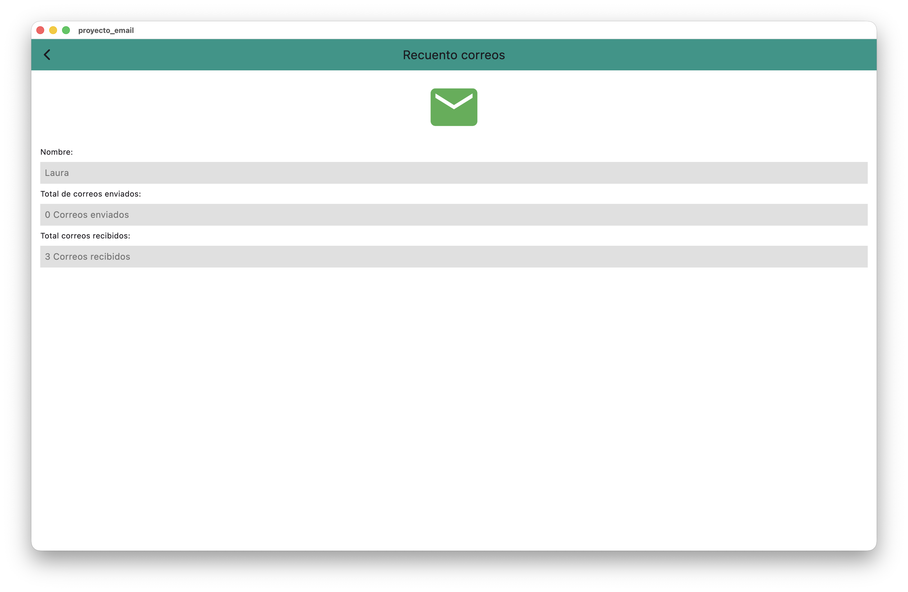

# 📧 Proyecto Email

Aplicación desarrollada en **Flutter** que permite gestionar el envío y recepción de correos electrónicos entre alumnos y profesores.  
Incluye soporte multilenguaje, almacenamiento local con **SQLite**, y un diseño limpio e intuitivo.

---

## 📚 Índice

1. [🚀 Funcionalidades principales](#-funcionalidades-principales)  
2. [📸 Capturas de pantalla](#-capturas-de-pantalla)  
3. [🧱 Tecnologías utilizadas](#-tecnologías-utilizadas)  
4. [👨‍💻 Instalación y ejecución](#-instalación-y-ejecución)  
5. [👥 Autor](#-autor)  
6. [📄 Licencia](#-licencia)

---

## 🚀 Funcionalidades principales

- 📩 **Enviar y recibir correos** entre usuarios registrados.  
- ✅ **Marcar correos como leídos/no leídos**.  
- 🗑️ **Eliminar mensajes** fácilmente.  
- 👨‍🏫 **Filtrar correos** por tipo de usuario (alumno / profesor).  
- 🌍 **Soporte de idiomas** (Español / Inglés).  
- 💾 **Sesión persistente** con SharedPreferences.  
- 🎨 **Interfaz moderna** basada en Material Design.

---

## 📸 Capturas de pantalla

### 🔐 Pantalla de inicio de sesión
Permite iniciar sesión o registrarse en el sistema.  

---

### 📬 Bandeja de entrada
Muestra los correos recibidos, diferenciando los leídos con distintos colores.  

---

### ✉️ Envío de correos
El usuario puede redactar y enviar mensajes a otros usuarios.  

---

### 🧑‍🏫 Filtros de búsqueda
Permite filtrar correos por tipo de usuario (profesor o alumno), eliminar correos o marcarlos como vistos.  

---

### ⚙️ Ajustes e idioma, cuenta y estadísticas
En esta sección el usuario puede:
- 🌍 Cambiar el idioma o el color del tema.  
- 🔑 Modificar su contraseña, cerrar sesión o eliminar la cuenta.  
- 📊 Visualizar el recuento de correos enviados y recibidos.

---

## 🧱 Tecnologías utilizadas

| Tecnología | Descripción |
|-------------|-------------|
| 🐦 Flutter | Framework principal para el desarrollo multiplataforma |
| 💬 Dart | Lenguaje de programación |
| 💾 SQLite | Base de datos local |
| ⚙️ Provider | Gestión del estado |
| 🔑 SharedPreferences | Persistencia de datos del usuario |
| 🎨 Material Design | Diseño de la interfaz |

---

## 👥 Autor

**Pablo Villagrán González**  
📍 Valladolid, España  
🔗 [GitHub - PabloVillagranGonz](https://github.com/PabloVillagranGonz)

---

✨ *Desarrollado con Flutter y mucha pasión por el código limpio.* 🚀
